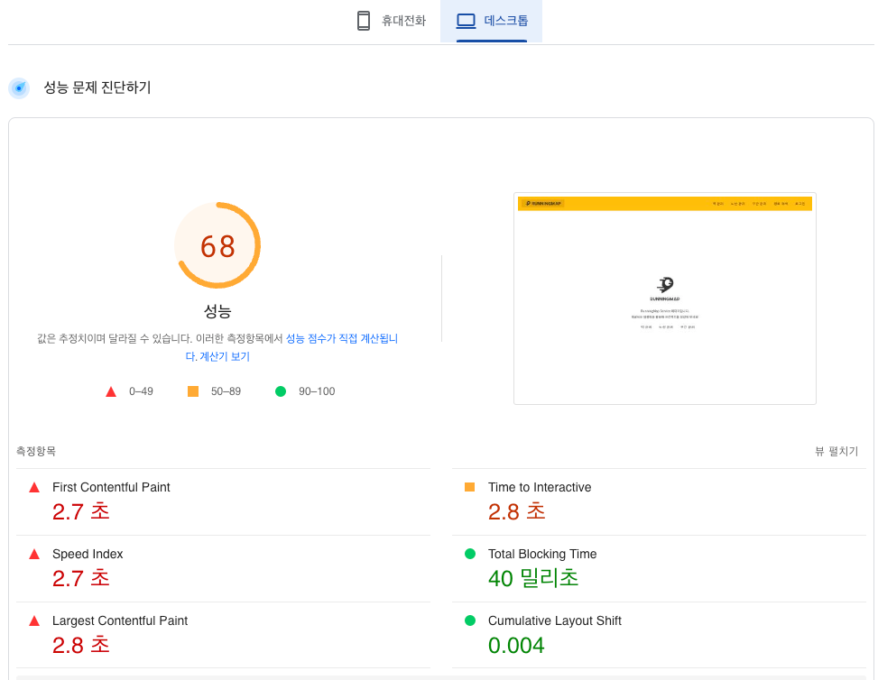
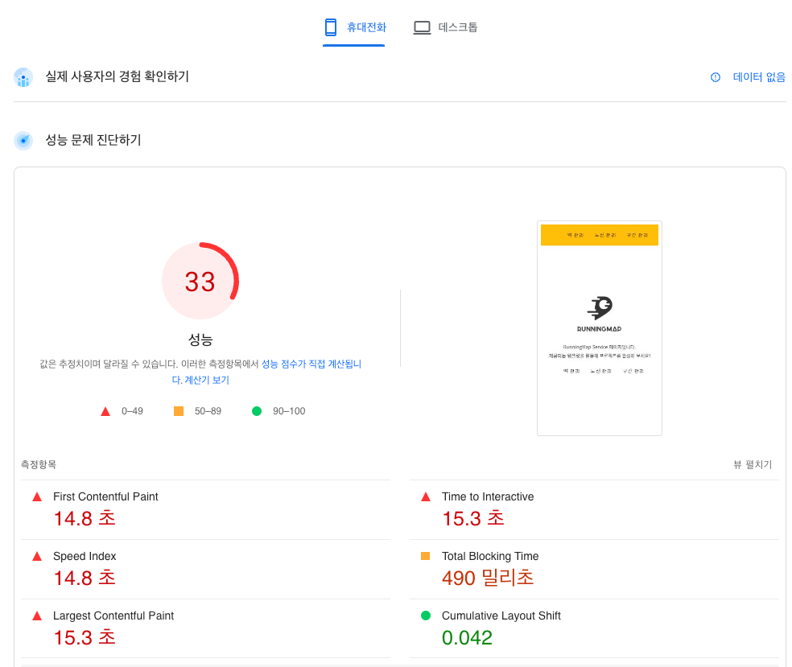
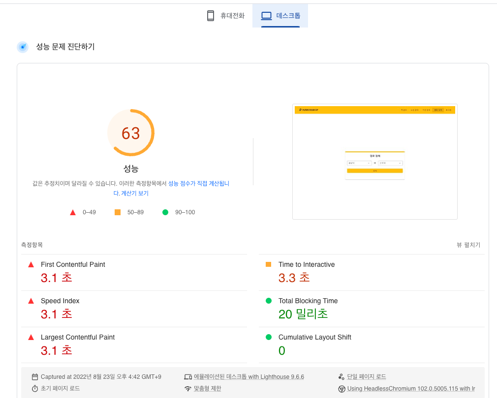

<p align="center">
    
</p>
<p align="center">
  
  
  <a href="https://edu.nextstep.camp/c/R89PYi5H" alt="nextstep atdd">
    
  </a>
  
</p>

<br>

# 인프라공방 샘플 서비스 - 지하철 노선도

<br>

## 🚀 Getting Started

### Install
#### npm 설치
```
cd frontend
npm install
```
> `frontend` 디렉토리에서 수행해야 합니다.

### Usage
#### webpack server 구동
```
npm run dev
```
#### application 구동
```
./gradlew clean build
```
<br>


### 1단계 - 웹 성능 테스트
1. 웹 성능예산은 어느정도가 적당하다고 생각하시나요

# 예비 분석
### 사용자 트래픽이 많거나 중요한 페이지는?
- 메인 페이지 (`/`)
- 경로 검색 페이지 (`/path`)

### 메인 페이지 (/) 



### 경로 검색 페이지 (/path)



### 경쟁사(카카오맵)
점수가 가장 좋은 카카오맵 을 기준으로 잡았습니다.


### 문제점

- 모바일 환경 기준 렌더링 시간(FCP, LCP)이 평균 15초로 너무 높습니다.
  - 권장하는 FCP: 1.8 초 / 권장하는 LCP: 2.5초

- 경쟁사랑 FCP 기준으로 비교 하였을때 10배이상의 시간이 차이난다.

###  성능 기준 설정하기
본업에서 같은 결과가 나온다면 Timing based Metric 를 기준으로 성능 최적화를 해야 된다고 생각합니다.
결론적으로 FCP 를 최소 경쟁사 대비 20% 성능차이 미만인 2.04 초( 1.7 * 1.2 )를 목표로 작업해야 된다고 생각합니다.

---

2. 웹 성능예산을 바탕으로 현재 지하철 노선도 서비스는 어떤 부분을 개선하면 좋을까요
   1. JavaScript 이번트 코드 파일 gzip 압축 방식 제공
   2. 페이지 별로 사용하는 js 코드만 빌드하게 변경
   3. css 파일 분리
   4. img, js, css 정적 파일 CDN 에서 가져오는 방식으로 변경
   5. 지하철역, 노선 구간등 자주 사용하는 데이터 캐시로 저장

---

### 2단계 - 부하 테스트 
1. 부하테스트 전제조건은 어느정도로 설정하셨나요
   - 우선 예상 1일 사용자 수(DAU)를 정해봅니다.
     - DAU : 2만 명
       - 처음 서비스를 오픈한다고 생각하고 카카오 맵 사용자를 30% 로 높게 데려온다고 생각했습니다.
   - 피크 시간대의 집중률을 예상해봅니다. (최대 트래픽 / 평소 트래픽)
     - (최대 트래픽: 12000명 (60%) / 평소 트래픽: 2000명 (10%) )
   - 1명당 1일 평균 접속 혹은 요청수를 예상해봅니다.
     - 평균 요청수: 23 = 5 (메인페이지 접속 1 + 경로검색 3 + 기타 1)  X  4 (하루 수균 접속수) + 3 (로그인시 요청)
   - 이를 바탕으로 Throughput(시간당 처리량)을 계산합니다. 
     - 1일 총 접속수: 460000  = 20000 (DAU) X 23 (1명당 1일 평균 요청 수)
     - 1일 평균 rps: 5.3 = 460000 (1일 총 접속 수) / 86,400 (초/일)
     - 1일 최대 rps: 31.8  = 5.3 *  6 (60 / 10)
     - VUser 구하기
       - 2.8(T) = 3 (R) * 0.6(http_req_duration) + 1
       - 평균  VUser: 5(VUser) = 5.3 (RPS) *  2.8(T) / 3 (R) 
       - 최대  VUser: 30(VUser) = 31.8 (RPS) *  2.8(T) / 3 (R)

2. Smoke, Load, Stress 테스트 스크립트와 결과를 공유해주세요
    - 테스트 시나리오
        1. 메인 페이지 접속
        2. 로그인 페이지 접속
        3. 로그인 한번 실패
        4. 로그인 성공
        5. 경로 검색 페이지 접속
        6. 경로 검색 버튼 클릭
   1. Smoke
      -  
       
   2. Stress
   
   3. Load
       - 
---

### 3단계 - 로깅, 모니터링
1. 각 서버내 로깅 경로를 알려주세요

2. Cloudwatch 대시보드 URL을 알려주세요
